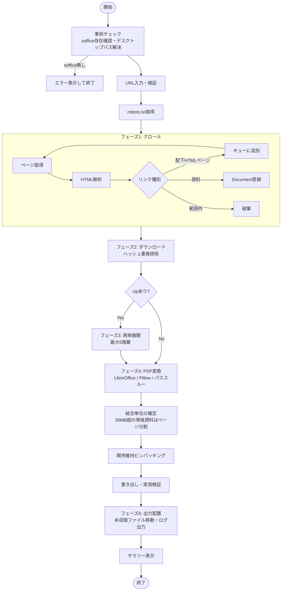
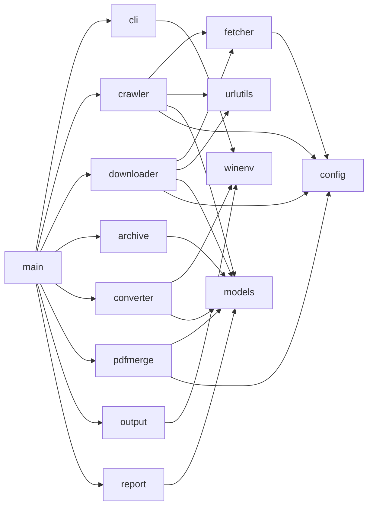
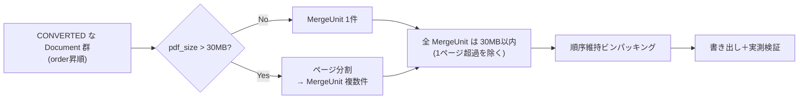
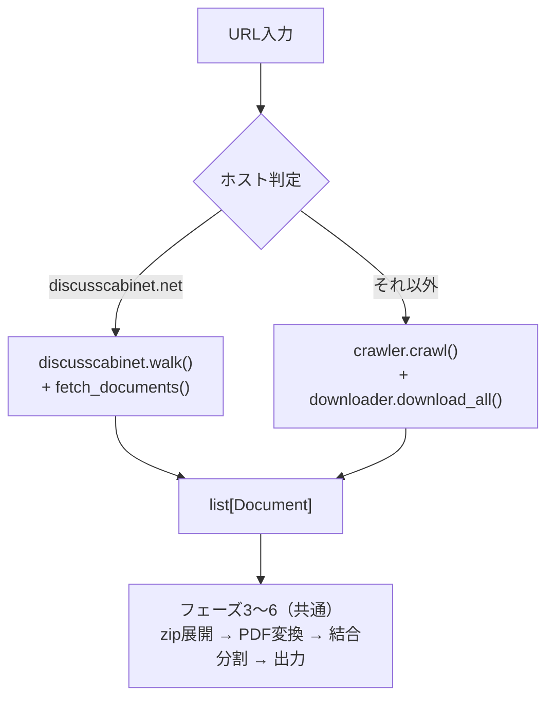

# 設計書
## さいたま市文書スクレイピング・PDF統合ツール

- 作成日: 2026-08-21
- バージョン: 0.1
- 対応要件定義書: [requirements.md](./requirements.md) v0.1

---

## 1. 概要

本書は要件定義書に基づく実装設計を定める。処理は以下の6フェーズで構成し、各フェーズを独立したモジュールに割り当てる。

| # | フェーズ | 責務 | 主モジュール |
|---|---|---|---|
| 1 | クロール | 入力URL配下の全ページを巡回し、資料リンクを発見する | `crawler` |
| 2 | ダウンロード | 発見した資料を取得する | `downloader` |
| 3 | 展開 | zipを再帰展開し、中の資料を収集対象に加える | `archive` |
| 4 | 変換 | PDF以外の資料をPDF化する | `converter` |
| 5 | 結合・分割 | 全PDFを結合し、30MB以内になるよう分割する | `pdfmerge` |
| 6 | 出力 | 成果物をデスクトップに配置し、ログとサマリーを出力する | `output` / `report` |

設計上の中心概念は **`Document`**（1件の資料を表すレコード）である。全フェーズは `Document` のリストを段階的に更新していく形で進行し、各 `Document` は最終的に「結合資料PDFに収録された」か「収録されなかった（理由付き）」のいずれかの状態に到達する。この一貫した状態管理により、要件4.6の「収録されたものは削除、されなかったものは残す」という後片付けルールと、要件4.7のサマリー集計が同一のデータ構造から導出できる。

---

## 2. 実行環境・前提

| 項目 | 内容 |
|---|---|
| OS | Windows 10 / 11 |
| Python | 3.10 以上（`match` 文・`X \| Y` 型記法・`dataclasses` を使用） |
| 実行方法 | `python main.py` をコマンドプロンプトで実行 |
| LibreOffice | 事前インストール必須。`soffice` をPATH登録、または既定インストールパスに存在すること |
| ディスク空き容量 | 収集対象サイトの総資料サイズの約3倍（元ファイル＋変換後PDF＋結合結果） |

### 2.1 依存ライブラリ

`requirements.txt`:

```
requests>=2.32
beautifulsoup4>=4.12
lxml>=5.0
pypdf>=4.2
Pillow>=10.0
```

| ライブラリ | 用途 | 選定理由 |
|---|---|---|
| `requests` | HTTP通信 | ストリーミングダウンロード・セッション再利用・タイムアウト制御が扱いやすい |
| `beautifulsoup4` + `lxml` | HTML解析 | municipal siteに多い不正なHTMLでも解析が破綻しない。文字コード自動判定も利用する |
| `pypdf` | PDF結合・分割・暗号化解除 | PyPDF2の後継。純Pythonで追加バイナリ不要 |
| `Pillow` | 画像→PDF変換 | 6.5節参照 |

標準ライブラリからは `urllib.parse`（URL正規化）、`urllib.robotparser`（robots.txt）、`zipfile`（展開）、`subprocess`（LibreOffice呼び出し）、`hashlib`（重複判定）、`ctypes`（デスクトップパス解決）、`tempfile`、`csv`、`dataclasses` を使用する。

---

## 3. 全体アーキテクチャ

### 3.1 処理フロー



### 3.2 モジュール構成

```
scraping-for-saitama-city-document/
├─ main.py                  エントリポイント（利用者が実行するファイル）
├─ requirements.txt
├─ docs/
│  ├─ requirements.md
│  └─ design.md
└─ scraper/
   ├─ __init__.py
   ├─ config.py             設定値・定数
   ├─ models.py             Document / Status / Summary
   ├─ cli.py                URL入力・進捗表示・サマリー表示
   ├─ winenv.py             Windows固有処理（デスクトップパス・コンソール・soffice探索）
   ├─ urlutils.py           URL正規化・スコープ判定・ファイル名生成
   ├─ fetcher.py            HTTPセッション・レート制御・リトライ・robots.txt
   ├─ crawler.py            BFSクロール・リンク抽出
   ├─ downloader.py         資料ダウンロード・内容ハッシュ重複排除
   ├─ archive.py            zip再帰展開
   ├─ converter.py          PDF変換ディスパッチ
   ├─ pdfmerge.py           結合単位確定・ビンパッキング・ページ分割
   ├─ output.py             出力フォルダ作成・未収録ファイル配置・作業ディレクトリ管理
   └─ report.py             log.txt / manifest.csv 生成
```

### 3.3 モジュール依存関係



`main.py` がオーケストレータとして各フェーズを順に呼び出す。フェーズ間の受け渡しは `list[Document]` のみで、モジュール間の直接依存は持たせない。これにより各フェーズを個別にテスト・差し替えできる。

---

## 4. データモデル（`scraper/models.py`）

### 4.1 Status

```python
class Status(StrEnum):
    DISCOVERED       = "発見"          # クロールで発見、未ダウンロード
    DOWNLOADED       = "取得済"        # ダウンロード完了
    EXTRACTED        = "展開済"        # zip内から取り出した
    CONVERTED        = "変換済"        # PDF化完了（元がPDFの場合も含む）
    MERGED           = "収録済"        # 結合資料PDFに収録された（最終正常状態）

    SKIPPED_ROBOTS   = "除外:robots"   # robots.txtによる除外
    SKIPPED_DUP_URL  = "除外:URL重複"
    SKIPPED_DUP_HASH = "除外:内容重複"
    SKIPPED_ARCHIVE  = "除外:zip本体"  # zip自体は結合対象外（中身のみ対象）

    FAILED_DOWNLOAD  = "失敗:取得"
    FAILED_EXTRACT   = "失敗:展開"
    FAILED_CONVERT   = "失敗:変換"
    FAILED_MERGE     = "失敗:結合"
```

`SKIPPED_*` と `FAILED_*` の区別が後片付けの判断基準になる。

- `MERGED` … 結合資料PDFに内容が含まれる → 元ファイル削除（要件4.6）
- `SKIPPED_DUP_*` … 内容は別の資料として収録済み → 元ファイル削除
- `SKIPPED_ROBOTS` … そもそもダウンロードしていない → 削除対象なし
- `SKIPPED_ARCHIVE` … zip本体。中身が収録されていれば削除、1件も収録できなければ `_未収録ファイル` へ
- `FAILED_*` … 収録されていない → `_未収録ファイル` へ移動

### 4.2 Document

```python
@dataclass
class Document:
    order: tuple[int, ...]          # 結合順序キー（6.2.3参照）
    source_page: str                # 発見元ページURL（zip内は親zipのURL）
    url: str | None                 # 資料URL。zip内ファイルは None
    origin: Literal["web", "zip"]
    archive_member: str | None      # zip内パス（origin=="zip" のとき）
    original_name: str              # 元のファイル名（表示・ログ用）
    ext: str                        # 小文字・ドット付き（".pdf"）

    local_path: Path | None = None  # 作業ディレクトリ上の元ファイル
    content_hash: str | None = None # SHA-256
    size: int | None = None         # 元ファイルのバイト数
    pdf_path: Path | None = None    # 変換後PDF（元がPDFなら local_path と同一）
    pdf_size: int | None = None

    status: Status = Status.DISCOVERED
    error: str | None = None
    output_file: str | None = None  # 収録先ファイル名（例: "結合資料_002.pdf"）
    output_pages: str | None = None # 収録先での該当ページ範囲（例: "12-31"）
```

`output_file` / `output_pages` を保持することで、manifest.csv から「どの資料が最終成果物のどこに入ったか」を追跡できる。

### 4.3 結合単位（MergeUnit）

結合・分割処理では `Document` をそのまま扱わず、**分割してはならない最小単位**を表す `MergeUnit` に変換する（6.6節参照）。

```python
@dataclass
class MergeUnit:
    order: tuple[int, ...]
    docs: list[Document]      # 通常は1件。ページ分割時も元は1件
    pdf_path: Path            # 実体（ページ分割時は分割済み一時PDF）
    size: int
    page_count: int
    part: tuple[int, int] | None  # (1, 3) = 3分割のうち1つ目。分割していなければ None
```

---

## 5. 設定値（`scraper/config.py`）

```python
# --- サイズ ---
SIZE_LIMIT        = 30 * 1024 * 1024   # 30MB（要件4.5）
PACK_MARGIN       = 0.93               # ビンパッキングの推定マージン（6.6.2参照）

# --- クロール ---
REQUEST_INTERVAL  = 3.0                # 秒。全HTTPリクエストに適用（要件4.2）
MAX_PAGES         = None               # None = 無制限（要件No.3）
MAX_ARCHIVE_DEPTH = 5                  # zip再帰展開の上限（要件4.3）
USER_AGENT        = "SaitamaDocCollector/0.1 (+contact: <利用者メールアドレス>)"

# --- HTTP ---
CONNECT_TIMEOUT   = 10.0
READ_TIMEOUT      = 60.0
MAX_RETRIES       = 3
RETRY_BACKOFF     = [3.0, 6.0, 12.0]   # リトライ間隔（秒）
RETRY_STATUS      = {429, 500, 502, 503, 504}

# --- 変換 ---
SOFFICE_TIMEOUT   = 180                # 秒。1ファイルあたりの変換タイムアウト

# --- 対象拡張子（要件4.3）---
EXT_PDF    = {".pdf"}
EXT_OFFICE = {".doc", ".docx", ".xls", ".xlsx", ".ppt", ".pptx"}
EXT_TEXT   = {".txt", ".csv"}
EXT_IMAGE  = {".jpg", ".jpeg", ".png", ".gif", ".bmp", ".tif", ".tiff"}
EXT_ARCHIVE= {".zip"}
EXT_TARGET = EXT_PDF | EXT_OFFICE | EXT_TEXT | EXT_IMAGE | EXT_ARCHIVE

EXT_HTML   = {"", ".html", ".htm", ".shtml", ".php", ".asp", ".aspx", ".jsp"}

# --- URL正規化 ---
TRACKING_PARAMS = {"utm_source", "utm_medium", "utm_campaign", "utm_term",
                   "utm_content", "fbclid", "gclid", "_ga"}

# --- 出力 ---
OUTPUT_PREFIX     = "さいたま市文書"
MERGED_NAME_FMT   = "結合資料_{:03d}.pdf"
UNCOLLECTED_DIR   = "_未収録ファイル"
```

全ての設定値をこのモジュールに集約し、マジックナンバーをコード中に散在させない。

---

## 6. 主要アルゴリズム設計

### 6.1 URL正規化とスコープ判定（`scraper/urlutils.py`）

#### 6.1.1 正規化

```python
def normalize(url: str, base: str | None = None) -> str | None:
```

処理順序:

1. `base` があれば `urljoin(base, url)` で絶対URL化する。HTML内に `<base href>` がある場合はそれを `base` として優先する。
2. スキームが `http` / `https` 以外（`mailto:`, `javascript:`, `tel:` 等）なら `None` を返す。
3. スキーム・ホスト名を小文字化する。
4. 既定ポート（http:80 / https:443）を除去する。
5. パスのドットセグメント（`/./`, `/../`）を解決する。
6. フラグメント（`#...`）を除去する。
7. クエリから `TRACKING_PARAMS` に該当するパラメータを除去する。**残ったパラメータの順序は変更しない**（順序に依存するサーバー実装があるため）。

#### 6.1.2 重複判定キー

```python
def dedup_key(url: str) -> tuple[str, str, str]:
    return (netloc, path, query)   # スキームを含めない
```

スキームをキーに含めないことで、`http://` と `https://` の同一ページを重複取得しない。

**ホスト名は厳密一致とする。** `example.com` と `www.example.com` は別サイト扱いになる。入力URLのホスト名がそのままスコープの基準になる旨を、実行時に確認メッセージとして表示する。

#### 6.1.3 スコープ判定

要件4.2「入力パス配下のみ」を以下のとおり具体化する。

```python
def scope_prefix(base_url: str) -> str:
    path = urlsplit(base_url).path
    if path in ("", "/"):
        return "/"
    if path.endswith("/"):
        return path
    last = path.rsplit("/", 1)[-1]
    if "." in last:                     # /docs/index.html のようなファイル指定
        return path.rsplit("/", 1)[0] + "/"
    return path + "/"                   # /docs → /docs/

def in_scope(u: SplitResult, netloc: str, prefix: str) -> bool:
    if u.netloc != netloc:
        return False
    return u.path == prefix.rstrip("/") or u.path.startswith(prefix)
```

判定例（入力 `https://example.com/docs`、prefix = `/docs/`）:

| URL | 判定 | 理由 |
|---|---|---|
| `https://example.com/docs` | ○ | 入力URL自身 |
| `https://example.com/docs/2024/a.html` | ○ | prefix配下 |
| `https://example.com/docs2/a.html` | × | `/docs/` で始まらない |
| `https://other.com/docs/a.html` | × | ホスト不一致 |

入力が `https://example.com/docs/index.html` のようにファイルを指す場合、そのディレクトリ `/docs/` 全体をスコープとする。特定の1ページだけを対象にする意図の入力を、その配下全体の収集として解釈する仕様である。

#### 6.1.4 ローカルファイル名の生成

URL由来のファイル名をそのまま使うと、Windowsの禁止文字・予約名・MAX_PATH（260文字）制限・重複のすべてに抵触しうる。以下の方式で回避する。

```python
def local_filename(order: tuple[int, ...], original_name: str, ext: str) -> str:
    stem = unquote(original_name)              # %E8%B3%87%E6%96%99 → 資料
    stem = re.sub(r'[\\/:*?"<>|\x00-\x1f]', "_", stem)
    stem = stem.rstrip(". ")                   # 末尾のドット・空白は不可
    if stem.upper() in RESERVED_NAMES:         # CON, PRN, AUX, NUL, COM1-9, LPT1-9
        stem = "_" + stem
    stem = stem[:60]                           # 長さ制限
    seq = "-".join(str(n) for n in order)      # "12" / "12-3" / "12-3-1"
    return f"{seq:0>4}_{stem}{ext}"
```

作業ディレクトリは階層を作らずフラットに保ち、順序キーをファイル名先頭に付けることで一意性とソート可能性を同時に確保する。元のURL・元ファイル名は `Document` と manifest.csv に保持するため、情報は失われない。

### 6.2 クロール（`scraper/crawler.py`）

#### 6.2.1 アルゴリズム

幅優先探索（BFS）。ページの発見順が結合順序に直結するため、探索順序を決定的にする。

```python
queue    = deque([base_url])
visited  = {dedup_key(base_url)}     # ページの訪問済み集合
found    = {}                         # 資料URLの dedup_key → Document
page_seq = 0

while queue:
    url = queue.popleft()
    resp = fetcher.get(url)           # 3秒レート制御・robots判定・リトライ込み
    if resp is None:                  # 取得失敗 → ログ記録して継続
        continue

    if not is_html(resp):             # 6.2.2 の Content-Type フォールバック
        register_document(url, from_page=url)
        continue

    page_seq += 1
    html = decode(resp)               # 6.2.4 文字コード判定
    for link_seq, href in enumerate(extract_anchor_hrefs(html, base=url)):
        u = normalize(href, base=url)
        if u is None:
            continue
        if is_target_document(u):     # 拡張子が EXT_TARGET
            register_document(u, from_page=url, order=(page_seq, link_seq))
        elif in_scope(u) and is_html_like(u) and dedup_key(u) not in visited:
            visited.add(dedup_key(u))
            queue.append(u)
```

**リンク抽出は `<a href>` のみを対象とする**（要件4.3の画像に関する制限）。`` は走査しない。

#### 6.2.2 拡張子のないリンクへの対応

`/download?id=123` のように拡張子を持たない資料リンクが municipal site には存在する。以下のフォールバックで取りこぼしを防ぐ。

1. 拡張子で `EXT_TARGET` に該当すれば資料として確定。
2. 該当せず、スコープ内かつHTMLらしい拡張子（`EXT_HTML`）なら、ページとしてキューに追加する。
3. ページとして取得した結果、レスポンスの `Content-Type` がHTMLでなかった場合、その時点で資料として登録し直す。拡張子は `Content-Type` と `Content-Disposition: filename=` から決定する。

この方式なら追加のHEADリクエストが不要で、レート制御下でのリクエスト数を増やさずに済む。

#### 6.2.3 結合順序キー

要件4.5「クロールで発見した順（ページ順・ページ内リンク順）」を、タプルの辞書順で表現する。

| 資料の出自 | `order` の値 | 説明 |
|---|---|---|
| 3ページ目の2番目のリンク | `(3, 2)` | ページ順・リンク順 |
| 上記がzipで、その中の1番目 | `(3, 2, 1)` | zip内パス名の昇順で採番 |
| さらにその中のzipの1番目 | `(3, 2, 1, 1)` | 再帰的に付加 |

Pythonのタプル比較では `(3, 2) < (3, 2, 1) < (3, 3)` が成立するため、`sorted(docs, key=lambda d: d.order)` だけで「zipの中身は、そのzipがあった位置に展開順で並ぶ」という直感的な順序が得られる。

#### 6.2.4 文字コードの判定

さいたま市を含む自治体サイトには Shift_JIS / EUC-JP のページが残存する。`requests` の `resp.text` は誤判定しやすいため使用せず、以下の優先順位で決定する。

1. HTTPヘッダ `Content-Type: text/html; charset=...`
2. HTML内の `<meta charset>` / `<meta http-equiv="Content-Type">`
3. `charset_normalizer` による推定（`requests` に同梱）

実装上は `BeautifulSoup(resp.content, "lxml", from_encoding=header_charset)` に生バイト列を渡し、BeautifulSoup 内部の判定機構（UnicodeDammit）に 2・3 を委ねる。

#### 6.2.5 クローラトラップへの備え

上限を無制限とする要件のため、カレンダーページや無限にパラメータが増えるページで探索が終わらないリスクが残る。以下で緩和する。

- `visited` によるURL単位の重複排除（必須）
- `MAX_PAGES = None` は設定値として残し、必要時に値を入れれば上限を課せるようにしておく
- 1000ページごとに「現在N件を巡回中。中断する場合は Ctrl+C」と表示し、利用者が異常に気づけるようにする

### 6.3 HTTP層（`scraper/fetcher.py`）

単一の `Fetcher` インスタンスが全HTTPアクセスを仲介する。ページ取得と資料ダウンロードで同じインスタンスを共有することで、レート制御が全リクエストに一元的にかかる。

```python
class Fetcher:
    def __init__(self, base_url: str, interval: float = REQUEST_INTERVAL): ...
    def allowed(self, url: str) -> bool:        # robots.txt判定
    def get(self, url: str) -> Response | None: # ページ取得（本文をメモリに保持）
    def download(self, url: str, dest: Path) -> DownloadResult  # ストリーミング保存
```

**レート制御**: 直前のリクエスト完了時刻を保持し、次のリクエスト発行前に `REQUEST_INTERVAL` との差分だけスリープする。リトライの待機時間もこの間隔とは別に加算する。

**robots.txt**: 起動時に `<scheme>://<netloc>/robots.txt` を取得し `RobotFileParser` に読み込ませる。取得失敗（404等）の場合は「制限なし」として扱う（RFC上の慣行）。`Crawl-delay` が指定されており `REQUEST_INTERVAL` より大きい場合は、そちらを採用する（`interval = max(3.0, crawl_delay)`）。

**リトライ**: `MAX_RETRIES` 回まで、`RETRY_BACKOFF` の間隔で再試行する。対象は接続エラー・タイムアウト・`RETRY_STATUS` のHTTPステータス。4xx（429を除く）は再試行せず即座に失敗とする。

**ダウンロード**: `stream=True` で 1MB チャンクずつ書き出す。数百MBのファイルでもメモリを圧迫しない。書き込みと同時に SHA-256 を計算し、ダウンロード完了時点でハッシュを得る。

### 6.4 ダウンロードと重複排除（`scraper/downloader.py`）

要件4.3のURL単位の重複排除に加え、**内容ハッシュによる重複排除**を行う。自治体サイトでは同一のPDFが複数の階層から異なるURLで参照されることが多く、URL単位の排除だけでは結合資料に同じ文書が繰り返し現れる。要件4.6で示された「内容が重複するものは残さない」方針とも整合する。

```python
seen_hash: dict[str, Document] = {}

for doc in sorted(documents, key=lambda d: d.order):
    result = fetcher.download(doc.url, work_dir / local_filename(...))
    if result.failed:
        doc.status = Status.FAILED_DOWNLOAD; doc.error = result.reason
        continue
    doc.local_path, doc.content_hash, doc.size = result.path, result.sha256, result.size

    if doc.content_hash in seen_hash:
        first = seen_hash[doc.content_hash]
        doc.status = Status.SKIPPED_DUP_HASH
        doc.error  = f"{first.original_name}（{first.url}）と同一内容"
        doc.local_path.unlink()
        continue
    seen_hash[doc.content_hash] = doc
    doc.status = Status.DOWNLOADED
```

`order` の昇順で処理するため、重複時に残るのは常に「先に発見された方」となり、結果が決定的になる。

### 6.5 zip展開（`scraper/archive.py`）

```python
def extract(doc: Document, depth: int) -> list[Document]:
```

- `zipfile.ZipFile` で開き、`namelist()` を**パス名の昇順**でソートして採番する（順序の決定性確保）。
- 各メンバのうち `EXT_TARGET` に該当する拡張子のものだけを `Document` 化する。ディレクトリエントリは無視する。
- 生成した `Document` の `order` は親の `order + (index,)`、`origin` は `"zip"`、`source_page` は親zipのURLを引き継ぐ。
- 中に zip があれば `depth + 1` で再帰する。`depth >= MAX_ARCHIVE_DEPTH`（5）に達したら展開せず、当該zipを `FAILED_EXTRACT`（理由: 階層上限）とする。
- 展開後のファイルにも 6.4 と同じ内容ハッシュ重複排除を適用する。
- zip本体は結合対象にしないため `SKIPPED_ARCHIVE` とする。

**セキュリティ対策（Zip Slip）**: メンバ名に `..` や絶対パスが含まれる場合、展開先が作業ディレクトリ外に脱出しうる。展開先パスを解決したうえで、作業ディレクトリ配下であることを検証してから書き出す。範囲外のメンバはスキップしログに記録する。

**その他の失敗**: パスワード保護（`RuntimeError`）、破損（`BadZipFile`）は `FAILED_EXTRACT` としてログに記録し、処理を継続する。zip本体は `_未収録ファイル` に残す。

### 6.6 PDF変換（`scraper/converter.py`）

拡張子に応じて変換器をディスパッチする。

| 拡張子 | 変換器 | 処理 |
|---|---|---|
| `.pdf` | `PassThrough` | 変換不要。`pdf_path = local_path` |
| Office / `.txt` / `.csv` | `LibreOffice` | `soffice --headless --convert-to pdf` |
| 画像 | `Pillow` | 画像を1ページのPDFに変換 |
| `.zip` | （対象外） | 展開済みのため変換しない |

#### 6.6.1 LibreOffice変換

```
soffice --headless --norestore --nolockcheck
        -env:UserInstallation=file:///<work>/lo_profile
        --convert-to pdf --outdir <work>/converted <入力ファイル>
```

- **`-env:UserInstallation` は必須**。これを指定しないと、利用者が通常のLibreOfficeを開いている間、ヘッドレス変換がプロファイルのロック競合で失敗する。専用の一時プロファイルを作業ディレクトリ内に確保する。
- 1ファイルずつ逐次実行する。複数ファイルをまとめて渡す方が高速だが、どのファイルで失敗したかの特定が困難になるため、失敗の追跡性を優先する。
- `SOFFICE_TIMEOUT`（180秒）を超えたらプロセスを強制終了し `FAILED_CONVERT` とする。
- 出力ファイル名は入力の拡張子を `.pdf` に置換したものになる。ローカルファイル名が順序キーで一意化されているため（6.1.4）、出力先での衝突は起きない。
- 正常終了（returncode 0）でも出力ファイルが生成されない場合がある。**必ず出力ファイルの存在を確認する**。

#### 6.6.2 画像のPDF変換

要件4.4はLibreOfficeによる変換を定めているが、画像については Pillow を使用する設計とする。LibreOffice は画像を Draw 文書として扱うため、ページ余白の付加や用紙サイズへの強制的な縮尺が入り、原寸が保たれない。Pillow の `Image.save(pdf, "PDF")` は画像1枚をそのままの寸法で1ページのPDFにできる。

処理: RGBA / P モードの画像は白背景に合成して RGB に変換したうえで保存する（PDFはアルファチャンネルを持てないため）。マルチページTIFFは全フレームを複数ページとして保存する。

**この点は要件定義書からの変更にあたるため、11章に確認事項として記載する。**

#### 6.6.3 PDFの健全性検証

ダウンロードしたPDFがそのまま結合できるとは限らない。変換フェーズの最後に全PDFを検証する。

- `PdfReader(path, strict=False)` で開く。
- **暗号化されている場合、まず空パスワードでの復号を試みる**（`reader.decrypt("")`）。印刷・編集制限のみを掛けた自治体PDFはこれで開けることが多い。失敗した場合は `FAILED_CONVERT`（理由: パスワード保護）とする。
- ページ数が0、または読み込み時に例外が発生するものは `FAILED_CONVERT`（理由: PDF破損）とする。
- 検証を通過したものだけを `CONVERTED` とし、`pdf_size` と `page_count` を記録する。

### 6.7 結合と30MB分割（`scraper/pdfmerge.py`）

要件4.5の制約を整理すると次の3点になる。

1. 結合順序は `order` の昇順
2. 1つの資料の途中でファイルを分割しない
3. 出力ファイルは全て30MB以内（1資料単体が30MB超のときのみページ分割、1ページ単体が30MB超のときのみ超過を許容）

素直に実装すると「資料単位を保つ」制約と「単体超過時はページ分割する」例外が絡み合って複雑になる。そこで **`MergeUnit`（分割してはならない最小単位）を先に確定させる前処理**を挟み、以降は単純なビンパッキングに帰着させる。



#### 6.7.1 前処理: 単体30MB超の資料をページ分割

```python
def split_oversized(doc: Document) -> list[MergeUnit]:
    reader = PdfReader(doc.pdf_path)
    n = len(reader.pages)
    units, start = [], 0
    avg = doc.pdf_size / n                       # 1ページあたりの平均サイズ
    while start < n:
        guess = max(1, int(SIZE_LIMIT / avg))    # 推定ページ数
        end   = fit_by_binary_search(reader, start, min(start + guess, n), n)
        if end == start:                          # 1ページで超過 → 許容
            end = start + 1
            log.warning(f"{doc.original_name}: 1ページで30MBを超過")
        units.append(write_chunk(reader, start, end))
        start = end
    return units
```

`fit_by_binary_search` は「`start` から何ページまで入れれば30MB以内に収まるか」を、実際に `PdfWriter` で `io.BytesIO` に書き出してサイズを測りながら二分探索する。平均ページサイズによる初期推定を起点にすることで、測定回数を `O(log n)` 程度に抑える。

#### 6.7.2 ビンパッキング

全 `MergeUnit` が30MB以内であることが保証されているため、順序を保った貪欲法で詰め込める。

```python
def pack(units: list[MergeUnit]) -> list[list[MergeUnit]]:
    batches, cur, cur_size = [], [], 0
    for u in units:
        if cur and cur_size + u.size > SIZE_LIMIT * PACK_MARGIN:
            batches.append(cur); cur, cur_size = [], 0
        cur.append(u); cur_size += u.size
    if cur:
        batches.append(cur)
    return batches
```

#### 6.7.3 実測による検証と後退

**結合後のPDFサイズは元ファイルサイズの単純な合計と一致しない。** pypdf は各ソースのオブジェクトをそのまま書き出すため実際にはやや増加するが、その増分は文書構造に依存し事前に正確な予測ができない。したがって推定で詰めたあと、必ず実測して検証する。

```python
for batch in batches:
    path = out_dir / MERGED_NAME_FMT.format(idx)
    write_merged(batch, path)
    while path.stat().st_size > SIZE_LIMIT and len(batch) > 1:
        overflow.appendleft(batch.pop())    # 末尾の1件を次のバッチへ回す
        write_merged(batch, path)           # 書き直して再測定
    ...
```

`PACK_MARGIN = 0.93`（約27.9MB を目標）としているのは、この後退処理が起きる頻度を実用上ほぼゼロに抑えるためのマージンである。後退が発生した場合も正しく30MB以内に収まることは保証される。

#### 6.7.4 結合の実装

```python
writer = PdfWriter()
for unit in batch:
    reader = PdfReader(unit.pdf_path, strict=False)
    if reader.is_encrypted:
        reader.decrypt("")
    for page in reader.pages:
        writer.add_page(page)
writer.compress_identical_objects()   # 重複オブジェクトの共有化（サイズ削減）
with open(path, "wb") as f:
    writer.write(f)
```

各 `MergeUnit` の収録先ファイル名と開始・終了ページを記録し、`Document.output_file` / `output_pages` に反映する。

結合時に例外が発生した資料は、その資料のみを除外して当該バッチを再構築し、`FAILED_MERGE` として記録する。1件の破損PDFのために全体が失敗しないようにする。

### 6.8 出力と後片付け（`scraper/output.py`）

#### 6.8.1 デスクトップパスの解決

`%USERPROFILE%\Desktop` の直接参照は誤りになりうる。日本国内の Windows では OneDrive によりデスクトップが `%USERPROFILE%\OneDrive\デスクトップ` にリダイレクトされている環境が一般的で、この場合 `~\Desktop` は存在しないか、実際に画面に表示されるデスクトップとは別のフォルダになる。

Windows の Known Folder API を使用して正しく解決する。

```python
def desktop_dir() -> Path:
    import ctypes, ctypes.wintypes
    FOLDERID_Desktop = GUID("{B4BFCC3A-DB2C-424C-B029-7FE99A87C641}")
    buf = ctypes.c_wchar_p()
    hr = ctypes.windll.shell32.SHGetKnownFolderPath(
        ctypes.byref(FOLDERID_Desktop), 0, None, ctypes.byref(buf))
    if hr != 0:
        return Path.home() / "Desktop"   # フォールバック
    try:
        return Path(buf.value)
    finally:
        ctypes.windll.ole32.CoTaskMemFree(buf)
```

解決したパスは実行開始時に表示し、利用者が想定と異なる場合に気づけるようにする。

#### 6.8.2 作業ディレクトリ

要件4.6に従い、中間ファイルは出力フォルダではなく一時作業ディレクトリで扱う。

```
%TEMP%\saitama_doc_<YYYYMMDD_HHMMSS>\
├─ downloads\      ダウンロードした元ファイル
├─ extracted\      zip展開結果
├─ converted\      PDF変換結果
├─ chunks\         ページ分割した一時PDF
└─ lo_profile\     LibreOffice専用プロファイル
```

正常終了時に作業ディレクトリごと削除する。異常終了時は削除せず、パスをコンソールに表示して調査可能な状態を残す。

#### 6.8.3 出力フォルダの構築

```
<デスクトップ>\さいたま市文書_YYYYMMDD_HHMMSS\
├─ 結合資料_001.pdf
├─ 結合資料_002.pdf
├─ log.txt
├─ manifest.csv
└─ _未収録ファイル\      （該当0件なら作成しない）
```

配置ロジック:

1. 結合資料PDFを作業ディレクトリから出力フォルダへ移動する。
2. `FAILED_*` 状態の `Document` について、`local_path` が存在するものを `_未収録ファイル` へ移動する。ファイル名が衝突する場合は連番を付す。
3. `SKIPPED_ARCHIVE` のzipは、その子孫に1件でも `MERGED` があれば削除、1件もなければ `_未収録ファイル` へ移動する。
4. `MERGED` および `SKIPPED_DUP_*` の元ファイルは移動しない（作業ディレクトリ削除により消える）。
5. `_未収録ファイル` が空なら作成しない。
6. `log.txt` と `manifest.csv` を書き出す。
7. 作業ディレクトリを削除する。

同名の出力フォルダが既に存在する場合（同一秒内の再実行）は、末尾に `_2`, `_3` と連番を付す。

---

## 7. エラー処理設計

### 7.1 基本方針

要件No.7に従い、**個々の資料の失敗では処理を止めない**。フェーズ単位のループ内で例外を捕捉し、当該 `Document` に `FAILED_*` と理由を記録して次へ進む。

### 7.2 処理を中止する条件

以下は復旧不能なため、その時点でメッセージを表示して終了する。

| 条件 | メッセージ |
|---|---|
| `soffice` が見つからない | LibreOfficeのインストールとPATH設定を促す |
| 入力URLが不正、または初回アクセスに失敗 | URLの確認を促す |
| デスクトップに書き込めない | 権限・空き容量の確認を促す |
| 収集できた資料が0件 | 対象URLに資料が存在しない旨を表示 |

`soffice` の存在確認は**クロール開始前に行う**。数時間かけて収集した後に変換不能と判明する事態を避けるため、事前チェックの順序を厳守する。

### 7.3 中断（Ctrl+C）への対応

3秒間隔の逐次アクセスのため、大規模サイトでは数時間を要する。中断時に収集結果が全て失われるのは損失が大きいため、以下の挙動とする。

- クロール中の `KeyboardInterrupt` を捕捉する。
- その時点の収集件数を表示し、「収集済みの資料で処理を続行しますか？ (Y/N)」を問う。
- `Y` ならフェーズ2以降へ進む。`N` なら作業ディレクトリを残して終了する。
- ダウンロード以降のフェーズでの中断は、作業ディレクトリを残して即座に終了する。

### 7.4 ログ設計（`scraper/report.py`）

**`log.txt`**（UTF-8）— 人間が読む時系列ログ。

```
[2026-08-21 15:30:00] 開始 URL=https://example.com/docs/
[2026-08-21 15:30:01] robots.txt 取得成功 Crawl-delay=なし → 間隔3.0秒
[2026-08-21 15:30:04] ページ取得 (1) https://example.com/docs/
[2026-08-21 15:30:04]   資料発見 令和6年度予算.pdf
...
[2026-08-21 16:12:33] 失敗:変換 資料一覧.xlsx — LibreOfficeがタイムアウト(180秒)
...
[2026-08-21 17:05:00] 完了 収録 412件 / 未収録 7件 / 出力 5ファイル
```

**`manifest.csv`**（UTF-8 BOM付き）— 機械可読な資料一覧。**BOMを付けるのは、日本語Windowsの Excel が BOM なしUTF-8をCP932として解釈し文字化けするため。**

| 列 | 内容 |
|---|---|
| `順序` | `order` を `-` 区切りにした文字列 |
| `状態` | `Status` の日本語値 |
| `資料名` | `original_name` |
| `資料URL` | `url` |
| `発見元ページ` | `source_page` |
| `出自` | web / zip |
| `zip内パス` | `archive_member` |
| `サイズ` | 元ファイルのバイト数 |
| `収録先` | `結合資料_002.pdf` |
| `収録ページ` | `12-31` |
| `エラー` | 失敗・除外の理由 |

manifest.csv により、最終成果物のどのページがどのURLの資料に由来するかを完全に追跡できる。

---

## 8. コンソール出力設計（`scraper/cli.py`）

### 8.1 文字化け・例外の防止

日本語Windowsのコマンドプロンプトの既定コードページは CP932 である。CP932 で表現できない文字（一部の漢字・絵文字・特殊記号）を含むファイル名を `print` すると `UnicodeEncodeError` で異常終了する。

対策として、起動直後に標準出力・標準エラー出力のエラーハンドラを置換する。

```python
sys.stdout.reconfigure(errors="replace")
sys.stderr.reconfigure(errors="replace")
```

**エンコーディング自体は変更しない。** `encoding="utf-8"` に変更すると、コードページ932のコンソールでは全ての日本語が文字化けする。既定のCP932を維持したまま `errors="replace"` とすることで、表現できない文字だけが `?` に置き換わり、処理は継続する。ファイル名の完全な情報は UTF-8 の `log.txt` / `manifest.csv` に残る。

### 8.2 画面遷移

```
======================================================================
 さいたま市文書 収集ツール
======================================================================
LibreOffice: C:\Program Files\LibreOffice\program\soffice.exe
出力先デスクトップ: C:\Users\xxx\OneDrive\デスクトップ

対象URLを入力してください: https://example.com/docs/

対象範囲: https://example.com/docs/ 配下（ホスト example.com のみ）
robots.txt: 取得成功 / リクエスト間隔 3.0秒

[1/6] クロール中...
  ページ    123 件 | 資料発見    456 件 | 未訪問     12 件
[1/6] 完了: 135ページを巡回、468件の資料を発見しました。

  ダウンロード予想所要時間: 約 23分（3秒間隔 × 468件）

[2/6] ダウンロード中...
  456/468 (成功 453 / 失敗 3)
[2/6] 完了: 453件を取得、3件が失敗しました。

[3/6] zip展開中...
[3/6] 完了: 5件のzipから38件の資料を取り出しました。

[4/6] PDF変換中...
  120/486
[4/6] 完了: 482件を変換、4件が失敗しました。

[5/6] 結合・分割中...
[5/6] 完了: 5ファイルに分割しました。

[6/6] 出力中...

======================================================================
 処理が完了しました
======================================================================
出力先: C:\Users\xxx\OneDrive\デスクトップ\さいたま市文書_20260821_170500

  巡回ページ数        135
  ダウンロード      453 件成功 /   3 件失敗
  内容重複による除外  12 件
  PDF変換           482 件成功 /   4 件失敗
  結合資料PDF          5 ファイル（合計 142.3 MB / 最大 29.8 MB）
  未収録ファイル       7 件 → _未収録ファイル フォルダ

失敗した資料があります。詳細は log.txt / manifest.csv を確認してください。

何かキーを押すと終了します...
```

進捗行は `\r` による同一行更新とし、スクロールで画面が流れないようにする。最終行の待機（`input()`）は、コマンドプロンプトのアイコンをダブルクリックで実行した場合にウィンドウが即座に閉じてサマリーを読めなくなる事態を防ぐために入れる。

---

## 9. テスト方針

### 9.1 単体テスト対象（外部依存なしで検証可能な純粋関数）

| 対象 | 主なテストケース |
|---|---|
| `urlutils.normalize` | 相対URL解決、`../` の解決、フラグメント除去、トラッキングパラメータ除去、非HTTPスキームの排除 |
| `urlutils.scope_prefix` / `in_scope` | 6.1.3の判定例表、末尾スラッシュ有無、ファイル指定入力 |
| `urlutils.local_filename` | 禁止文字、予約名（CON等）、末尾ドット、長大名の切り詰め、パーセントエンコード解除 |
| `pdfmerge.pack` | 空入力、単一要素、境界ちょうど30MB、マージン直上・直下 |
| `pdfmerge.split_oversized` | 均等サイズ、末尾に巨大ページ、1ページで超過するケース |
| `models` の状態遷移 | 各 `Status` に対する後片付け判定の分岐 |

### 9.2 結合テスト

- ローカルHTTPサーバ（`http.server`）に、意図的に多様な構成のテストサイトを配置して実行する。
  - 階層3段、スコープ外リンク、循環リンク、Shift_JISページ、拡張子なし資料リンク、同一PDFへの複数URL、破損PDF、パスワード付きPDF、パスワード付きzip、多重zip、30MB超の単一PDF
- 検証項目: 収集件数、結合順序、出力ファイル数と各サイズが30MB以内であること、`_未収録ファイル` の内容、manifest.csv の追跡可能性

### 9.3 実サイトでの確認

本番実行前に、対象サイトの小さなサブパス（資料10件程度のディレクトリ）を指定して一巡させ、robots.txt の判定・文字コード・LibreOffice変換が正しく動くことを確認する。3秒間隔のため、いきなりサイト全体を指定すると問題発覚までに数時間を要する。

---

## 10. 想定される制約と留意事項

| 項目 | 内容 |
|---|---|
| 実行時間 | 3秒間隔の逐次アクセスのため、1000ページ＋2000資料の規模で約2.5時間を要する |
| JavaScript描画ページ | `requests` + `BeautifulSoup` は静的HTMLのみを解析する。JavaScriptで動的に生成されるリンクは収集できない。対象サイトがSPA構成の場合は Playwright 等への置き換えが必要になる |
| ディスク使用量 | 元ファイル・変換後PDF・結合結果が一時的に共存するため、総資料サイズの約3倍の空き容量を要する |
| 結合PDFのしおり | 本設計では結合PDFに目次・しおりを付けない。どの資料がどこにあるかは manifest.csv で追跡する（将来拡張の候補） |
| 利用規約 | robots.txt は遵守するが、サイトの利用規約による制約は本ツールでは判定できない。実行前に利用者が確認すること |

---

## 11. 要件定義書からの変更・追加事項

実装にあたり以下を設計上の判断として加えている。**No.1 は要件定義書を修正済み**、それ以外は設計書での追加提案であり、承認をいただきたい。

| No. | 項目 | 内容 | 理由 |
|---|---|---|---|
| 1 | **単体30MB超の資料の分割**（要件4.5・修正済み） | 「30MB超過を許容」から「ページ単位で分割し30MB以内に収める」へ変更 | 当初のご指示「一つ一つのファイルのデータ量が30mbを超えないように」および選択いただいた分割方式と矛盾していたため。1ページ単体で30MB超の場合のみ超過を許容 |
| 2 | 画像のPDF変換にPillowを使用（6.6.2） | 要件4.4はLibreOfficeを指定しているが、画像のみPillowで変換する | LibreOfficeは画像をDraw文書として扱うため余白付加・用紙サイズへの強制縮尺が入り、原寸が保たれない |
| 3 | 内容ハッシュによる重複排除（6.4） | URL単位に加え、SHA-256が一致する資料を除外する | 自治体サイトでは同一PDFが複数URLから参照されることが多く、結合資料に同じ文書が繰り返し現れるのを防ぐ。要件4.6の「内容が重複するものは残さない」方針とも整合 |
| 4 | manifest.csv の出力（7.4） | 資料単位の追跡表をCSVで出力する | 最終成果物のどのページがどのURL由来かを追跡可能にする。log.txtだけでは資料数が多い場合に実用的でない |
| 5 | 拡張子なしリンクのContent-Typeフォールバック（6.2.2） | ページとして取得した結果が非HTMLなら資料として扱う | `/download?id=123` 形式の資料リンクを取りこぼさない。追加リクエストが不要 |
| 6 | 暗号化PDFの空パスワード復号（6.6.3） | 結合前に `decrypt("")` を試みる | 印刷・編集制限のみを掛けた自治体PDFは多く、これらは空パスワードで開ける。無条件に失敗扱いにすると収集漏れが大きくなる |
| 7 | Ctrl+C時の続行選択（7.3） | クロール中断時に、収集済み資料での続行可否を問う | 数時間の収集結果が中断で全て失われるのを防ぐ |
| 8 | Known Folder APIによるデスクトップ解決（6.8.1） | `~\Desktop` ではなく `SHGetKnownFolderPath` を使う | OneDriveによるデスクトップリダイレクト環境では `~\Desktop` が実際のデスクトップと異なる |

---

## 11.5 サイト別アダプタ: DiscussCabinet

### 11.5.1 対応の経緯

対象サイトの1つ `https://www.discusscabinet.net/saitama/list`（さいたま市議会 文書管理システム）は、本設計の前提である「GETで取得したHTMLの `<a href>` を辿る」が成立しない。

- 資料への `<a href>` リンクが1本も存在しない
- 画面遷移は全て `document.forms[0].submit()` によるフォーム**POST**
- 遷移先は隠しフィールド（`cabinet_id` / `folder_id` / `docid` / `fileid` / `actions`）で指定する
- セッションCookieを伴う

JavaScriptの描画待ちではないため、ブラウザ自動化を足しても解決しない。プロトコルそのものが異なる。

### 11.5.2 プロトコル

実サイトへの調査で確認した手順。

| # | リクエスト | 主なパラメータ | 得られるもの |
|---|---|---|---|
| 1 | `GET /saitama/list` | — | セッションCookie、キャビネット一覧 |
| 2 | `POST /saitama/list` | `cabinet_id=N, folder_id=0` | キャビネット直下のフォルダ |
| 3 | `POST /saitama/list` | `folder_id=X, move=down` | フォルダの中身（サブフォルダ＋文書一覧） |
| 4 | `POST /saitama/list` | `actions=next` | 次ページ（1ページ10件） |
| 5 | `POST /saitama/doc_view` | `actions=doc_view, docid=D` | `fileid`、ファイル名、サイズ |
| 6 | `POST /saitama/file_view` | `fileid=F` | ファイル本体 |

- 各POSTは**直前の応答ページのフォーム状態を土台にする**。サーバーがフォーム値で状態を持つため、値を再構成するのではなく引き継ぐ。
- `folder_id` を直接指定すれば階層を辿らずに任意のフォルダへ飛べる。走査は木構造の深さ優先で行う。
- ページ送りは `start` を書き換えても効かず、`actions=next` で状態を進める必要がある。終了条件は「表示件数の終端 >= 全文書数」。

### 11.5.3 統合方針

**フェーズ1（クロール）とフェーズ2（ダウンロード）のみを差し替え、フェーズ3〜6は共通で再利用する。**



各フェーズ間の受け渡しを `list[Document]` に限定した設計（3.2節）がそのまま接続点になる。`main.py` は `_collect_generic` / `_collect_discusscabinet` のどちらかを呼び、以降は `_process` で共通処理する。

このサイトでは**一覧と本体取得が不可分**である（`fileid` は詳細画面にしか現れない）ため、専用アダプタはフェーズ1と2をまとめて担当し、`DOWNLOADED` 状態の `Document` を返す。

### 11.5.4 順序キー

`order` は `(キャビネット番号, 0, フォルダ番号, ..., 1, 文書番号)` の形とする。同一階層でフォルダを `0`、文書を `1` の名前空間に分けることで、タプルの辞書順が画面表示と同じ「サブフォルダが先、文書が後」の並びになる。1文書に複数の添付がある場合は末尾に連番を足す。

### 11.5.5 実装上の注意

- **文書一覧テーブルの列構成はフォルダによって異なる。** 日付列を持たないフォルダが実在するため、列位置に依存した解析をしてはならない。行内から `docid` を拾い、残りのセルのうち日付形式のものを日付、最も長いテキストを件名として扱う。
- 添付を持たない文書、詳細画面を開けない文書は `FAILED_DOWNLOAD` として記録し、処理を継続する。
- `file_view` がHTMLを返した場合はエラー画面なので失敗として扱う。
- 全体を対象にすると1文書あたり2リクエスト（詳細＋本体）を要し、非常に長時間になる。キャビネット単位の絞り込み（対話選択または `--cabinet`）と `--dry-run` による事前確認を必須の運用とする。

---

## 12. 将来拡張の候補

本バージョンには含めないが、必要が生じた際の拡張余地として記録する。

- **中断・再開機能** — 作業ディレクトリに進捗状態（訪問済みURL・`Document` 一覧）をJSONで保存し、再実行時に途中から再開する
- **結合PDFへのしおり付与** — 資料ごとにアウトライン項目を付け、PDFビューア上で目次から辿れるようにする
- **JavaScript対応** — `Playwright` によるレンダリング後のDOM解析
- **並列ダウンロード** — robots.txt の `Crawl-delay` を尊重しつつ、複数ホストにまたがる場合のみ並列化する
- **差分実行** — 前回実行時の manifest.csv と比較し、新規・更新された資料のみを収集する
